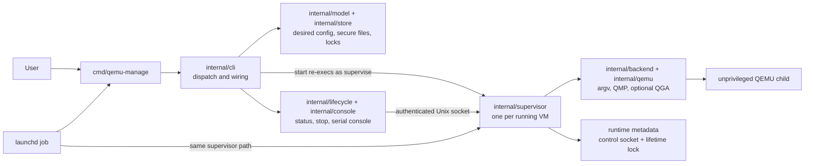

# qemu-manage

[](LICENSE)
[](https://opencode.ai/)
[](https://deepwiki.com/bradsjm/qemu-manage)

`qemu-manage` is a small command-line manager for headless QEMU virtual machines on Apple Silicon Macs. It manages VM configuration, lifecycle, serial consoles, networking, and launchd autostart without a persistent central daemon. It was built primarily to make it easier to manage QEMU for running Home Assistant in my Mac Mini M4 using a bridged network.

## Requirements

- Apple Silicon Mac running macOS 13 or newer
- Go 1.25 or newer to build from source or install with `go install`
- QEMU for AArch64 guests:

  ```sh
  brew install qemu
  ```

- Optional [`socket_vmnet`](https://github.com/lima-vm/socket_vmnet) installation for shared or bridged networking

The first release supports native AArch64 guests using QEMU's HVF accelerator. It does not silently fall back to cross-architecture emulation.

## Installation

### GitHub release

Download the latest archive from [GitHub Releases](https://github.com/bradsjm/qemu-manage/releases/latest). Release archives are unsigned and target Apple Silicon macOS only. macOS may require you to approve the specific `qemu-manage` binary in Privacy & Security before running it.

Replace `0.1.0` with the release version you want to install:

```sh
VERSION=0.1.0
curl -fLO "https://github.com/bradsjm/qemu-manage/releases/download/v${VERSION}/qemu-manage_${VERSION}_darwin_arm64.tar.gz"
curl -fLO "https://github.com/bradsjm/qemu-manage/releases/download/v${VERSION}/checksums.txt"
shasum -a 256 -c checksums.txt
tar -xzf "qemu-manage_${VERSION}_darwin_arm64.tar.gz"
mkdir -p "$HOME/.local/bin"
install -m 0755 qemu-manage "$HOME/.local/bin/qemu-manage"
```

Ensure `$HOME/.local/bin` is on your `PATH`.

### Install with Go

Install the latest release:

```sh
go install github.com/bradsjm/qemu-manage/cmd/qemu-manage@latest
```

Or install a specific version:

```sh
go install github.com/bradsjm/qemu-manage/cmd/qemu-manage@v0.1.0
```

This method requires Go 1.25 or newer and builds `qemu-manage` locally instead of installing the unsigned release archive.

### Build from source

```sh
go build -o qemu-manage ./cmd/qemu-manage
./qemu-manage --help
```

To make the command available globally, copy the resulting executable to a directory on `PATH`.

## Getting started

Inspect QEMU and firmware discovery before creating a VM:

```sh
qemu-manage doctor
```

### Common VM creation workflows

#### Import an HTTP(S) disk image

Pass an HTTP(S) URL to `--image` to download and import an ARM64 qcow2 or raw image directly. URL paths ending in `.xz` or `.gz` are decompressed while downloading, and the source is converted to a managed qcow2 disk:

```sh
qemu-manage create home-assistant \
  --image "https://github.com/home-assistant/operating-system/releases/download/18.0/haos_generic-aarch64-18.0.qcow2.xz" \
  --cpus 2 \
  --memory 4GiB \
  --disk-size 32GiB \
  --restart-policy on-failure
```

#### Import a local disk image

Use a local qcow2 or raw image when it is already on the Mac:

```sh
qemu-manage create appliance \
  --image "$HOME/Downloads/appliance-aarch64.qcow2" \
  --cpus 2 \
  --memory 4GiB \
  --disk-size 32GiB
```

Source images are copied and converted; the original local file is not modified.

#### Install from an ARM64 ISO

Pass a local installer ISO to `--iso`. `qemu-manage` creates the primary qcow2 disk, copies the ISO into managed storage, and boots the ISO before the disk. VNC is useful for graphical installers; set `VNC_PASSWORD` to a password of 1–8 UTF-8 bytes before running this example:

```sh
qemu-manage create linux \
  --iso "$HOME/Downloads/linux-arm64.iso" \
  --cpus 4 \
  --memory 4GiB \
  --disk-size 64GiB \
  --vnc \
  --vnc-password "$VNC_PASSWORD"
```

For advanced workflows, omitting both `--image` and `--iso` creates a blank 32GiB qcow2 disk by default.

After creating a VM, validate its files and host requirements before starting it:

```sh
qemu-manage doctor home-assistant
qemu-manage showcmd home-assistant
qemu-manage start home-assistant
qemu-manage status home-assistant
```

Connect to the guest's serial console and press `Ctrl-]` to disconnect:

```sh
qemu-manage console home-assistant
```

For an ISO installation using VNC:

```sh
qemu-manage doctor linux
qemu-manage start linux
qemu-manage status linux --json
qemu-manage vnc linux
```

VNC is disabled by default and binds to `127.0.0.1` when enabled. QEMU selects a free port in the configured range; JSON status reports the authenticated supervisor's live `vnc` endpoint. On macOS, `qemu-manage vnc NAME` copies the configured password to the clipboard and opens that live endpoint in Screen Sharing. The VM must be running or paused with its current configuration.

Request a graceful shutdown:

```sh
qemu-manage stop home-assistant
```

Run `qemu-manage COMMAND --help` for command-specific options and examples.

## Networking

VMs use QEMU user-mode networking by default. Host forwards bind explicitly to an IPv4 address:

```sh
qemu-manage set home-assistant \
  --network user \
  --forward tcp:127.0.0.1:8123:8123
```

`socket_vmnet` mode provides host/shared/bridged networking without running QEMU as root. It requires a separately installed and running helper service. Use `qemu-manage set NAME --help` and `qemu-manage doctor NAME` to configure and validate it.

## Autostart

Autostart uses a per-VM launchd job:

```sh
# Start after this user logs in.
qemu-manage autostart enable home-assistant --scope login

# Or start at system boot under the VM owner's account.
qemu-manage autostart enable home-assistant --scope boot

qemu-manage autostart status home-assistant
qemu-manage autostart disable home-assistant
```

Boot-scope changes require `sudo` for the narrow LaunchDaemon installation and launchctl operations. QEMU itself still runs as the non-root VM owner.

## Storage

Managed state is stored in macOS user directories:

- VM configuration and managed images: `~/Library/Application Support/qemu-manage/vms`
- Logs: `~/Library/Logs/qemu-manage`
- Ephemeral control sockets and runtime metadata: `/tmp/qemu-manage-<uid>`

Configuration files are strict, versioned JSON. Use `qemu-manage config show`, `config validate`, and `config apply` for complete configuration changes.

Set `QEMU_MANAGE_DATA_ROOT`, `QEMU_MANAGE_RUNTIME_ROOT`, or `QEMU_MANAGE_LOG_ROOT` to replace the corresponding default. Each override must be an absolute, owner-controlled directory; unset or empty variables retain the default. The runtime root must also remain short enough for macOS Unix-socket path limits. Autostart jobs preserve the selected roots explicitly because launchd does not inherit the shell environment.

VM configuration files are owner-only mode `0600`. An enabled VNC password is stored there in plaintext and `qemu-manage config show NAME` prints it. VNC password authentication accepts only 1–8 UTF-8 bytes. VNC transport is not encrypted; binding to an address other than loopback exposes it to that network.

## Architecture

`qemu-manage` is a single binary with no central daemon. `internal/cli` dispatches commands and wires the model, secure store, lifecycle services, QEMU backend, console, and launchd integration:



Each running VM has one supervisor that owns one QEMU child, its immutable-ID lifetime lock, runtime metadata, and authenticated control socket. Manual starts and launchd autostart use the same supervisor path. Durable JSON stores desired configuration only; live state comes from the supervisor and QEMU control protocols.

## Development

Developed using Code assistance from [Oh My Pi](https://omp.sh/) harness with GPT 5.6.

See [CONTRIBUTING.md](CONTRIBUTING.md) for local checks and contribution expectations. Security reports are handled according to [SECURITY.md](SECURITY.md).

## License

Licensed under the [Apache License 2.0](LICENSE).
