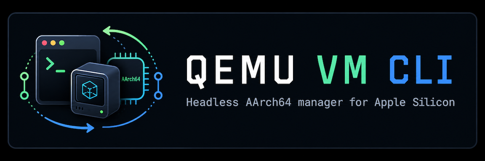
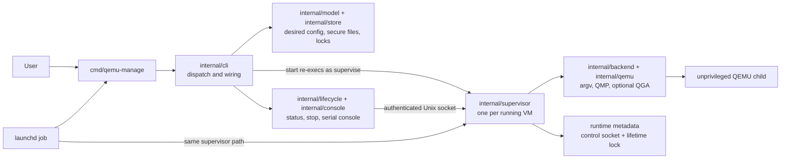

# qemu-manage

[](LICENSE)
[](https://opencode.ai/)
[](https://deepwiki.com/bradsjm/qemu-manage)



**A single-binary CLI for managing headless AArch64 QEMU virtual machines on Apple Silicon.** No persistent daemon, no database, no shell execution — just declarative JSON configs, per-VM supervisors, and authenticated control sockets.

## Features

- **VM lifecycle** — Create, start, stop, and inspect VMs with straightforward commands.
- **Disk import** — Pull images from HTTP(S) URLs (auto-decompresses `.xz`/`.gz`), copy local qcow2/raw images, or boot installer ISOs.
- **Serial console** — Connect to any guest with `Ctrl-]` disconnect handling.
- **Monitor & guest agent** — Use the interactive QEMU human monitor, run one-shot HMP commands, and send strict JSON guest-agent requests with pipe-safe stdout.
- **VNC passthrough** — Optional VNC with password auth; `qemu-manage vnc NAME` opens it in Screen Sharing with the password on your clipboard.
- **Networking** — User-mode NAT out of the box; optional `socket_vmnet` for shared or bridged mode without running QEMU as root, plus optional user-network SMB host-folder share.
- **Autostart** — Per-VM launchd jobs at login or boot scope; QEMU stays unprivileged.
- **Secure by design** — Atomic writes, owner-only file modes, peer-authenticated Unix sockets, immutable-ID lifetime locks, and no central service to attack.
- **Accelerated hardware** — All AArch64 guests use QEMU's HVF (Hypervisor.framework) native hardware virtualization accelerator for MacOS.

## Requirements

- Apple Silicon Mac running macOS 13 or newer
- Go 1.25+ to build from source (or use a prebuilt release)
- QEMU for AArch64 guests ([`qemu-system-aarch64`](https://formulae.brew.sh/formula/qemu))
- Only AArch64 guests are supported; no cross-architecture emulation
- _Optional [`socket_vmnet`](https://github.com/lima-vm/socket_vmnet) for shared or bridged networking_
- _Optional [`samba`](https://formulae.brew.sh/formula/samba) for the `--share` host-folder SMB export_

  ```sh
  brew install qemu
  brew install socket_vmnet
  brew install samba
  ```

  `qemu-manage` resolves `QEMU_MANAGE_SOCKET_VMNET_CLIENT` and
  `QEMU_MANAGE_SOCKET_VMNET_SOCKET` first, then falls back to independent
  discovery from common Homebrew or MacPorts locations.

## Installation

### Homebrew

Install the prebuilt Apple Silicon binary from the project's personal tap:

```sh
brew install bradsjm/tap/qemu-manage
```

The formula installs QEMU as a dependency. Optional `socket_vmnet` networking remains a separate installation.

### GitHub release

Download the latest archive from [GitHub Releases](https://github.com/bradsjm/qemu-manage/releases/latest). Archives are unsigned and target Apple Silicon only. macOS may ask you to approve the binary in Privacy & Security.

Replace `0.4.0` with the version you want to install:

```sh
VERSION=0.4.0
curl -fLO "https://github.com/bradsjm/qemu-manage/releases/download/v${VERSION}/qemu-manage_${VERSION}_darwin_arm64.tar.gz"
curl -fLO "https://github.com/bradsjm/qemu-manage/releases/download/v${VERSION}/checksums.txt"
shasum -a 256 -c checksums.txt
tar -xzf "qemu-manage_${VERSION}_darwin_arm64.tar.gz"
mkdir -p "$HOME/.local/bin"
install -m 0755 qemu-manage "$HOME/.local/bin/qemu-manage"
```

Make sure `$HOME/.local/bin` is on your `PATH`.

### Install with Go

```sh
# Latest release
go install github.com/bradsjm/qemu-manage/cmd/qemu-manage@latest

# Specific version
go install github.com/bradsjm/qemu-manage/cmd/qemu-manage@v0.4.0
```

Requires Go 1.25+ and builds locally — no unsigned binary needed.

### Build from source

```sh
go build -o qemu-manage ./cmd/qemu-manage
./qemu-manage --help
./qemu-manage --version
```

Copy the resulting binary to a directory on your `PATH` to make it globally available.

`--version` reports the release version, VCS revision and commit time, whether the
source tree was modified, the Go toolchain version, and the project repository.

## Quick start

Check that QEMU and firmware are discoverable:

```sh
qemu-manage doctor
```

Create a VM, inspect the rendered command, start it with diagnostics, connect to
its serial console, then shut it down:

```sh
qemu-manage create my-vm \
  --cpus 2 \
  --memory 4GiB \
  --network user \
  --forward tcp:127.0.0.1:2222:22 \
  --guest-agent on \
  --rtc-base utc

qemu-manage doctor my-vm
qemu-manage showcmd my-vm
qemu-manage --debug start my-vm
qemu-manage status my-vm

# Ctrl-] to disconnect
qemu-manage console my-vm

qemu-manage stop my-vm
```

Run `qemu-manage COMMAND --help` for command-specific options, examples, and
environment details.

## Creating a VM

You can create a VM from an HTTP(S) disk image, a local image file, an ARM64
installer ISO, or leave it blank. New VMs default to user networking with a
generated MAC, guest agent off, RTC base `utc`, and a concrete Arm machine
pinned from the selected QEMU binary as `virt-N.N`. When VNC is enabled, the
default keyboard layout is `en-us`.

Use `--mac MAC` to override the generated address at creation time. The value
must be a lowercase, six-byte, colon-separated hexadecimal locally administered
unicast MAC.

### Import from an HTTP(S) URL

Pass a qcow2 or raw URL to `--image`. URLs ending in `.xz` or `.gz` are
decompressed while downloading and converted to a managed qcow2 disk:

```sh
qemu-manage create home-assistant \
  --image "https://github.com/home-assistant/operating-system/releases/download/18.0/haos_generic-aarch64-18.0.qcow2.xz" \
  --cpus 2 \
  --memory 4GiB \
  --disk-size 32GiB \
  --network user \
  --forward tcp:127.0.0.1:2222:22 \
  --guest-agent on \
  --rtc-base utc \
  --restart-policy on-failure
```

### Import a local image

Pass a local qcow2 or raw path to `--image`. The source is copied and converted
— the original file is never touched:

```sh
qemu-manage create appliance \
  --image "$HOME/Downloads/appliance-aarch64.qcow2" \
  --mac 02:12:34:56:78:9a \
  --cpus 2 \
  --memory 4GiB \
  --disk-size 32GiB
```

### Provision a cloud image with cloud-init

Create a user-data file for a cloud-init-compatible AArch64 image:

```yaml
#cloud-config
users:
  - name: operator
    groups: [adm, sudo]
    sudo: ALL=(ALL) NOPASSWD:ALL
    shell: /bin/bash
```

Supply it when creating the VM:

```sh
qemu-manage create cloud-vm \
  --image "$HOME/Downloads/cloud-aarch64.qcow2" \
  --cloud-init-user-data "$HOME/Downloads/user-data" \
  --cpus 2 \
  --memory 4GiB
```

The guest image must support cloud-init's NoCloud datasource. qemu-manage uses
the supported macOS host's built-in `/usr/bin/hdiutil` to copy `user-data` into
a managed read-only ISO labelled `CIDATA` and generates `meta-data` with the VM
UUID as its `instance-id`. The source file need not remain after creation. The
seed stays attached across boots and is deleted with the VM; cloud-init normally
applies per-instance configuration only on the first boot.

User-data may contain secrets. Guest root can read those secrets from the
attached seed, so protect the source and provisioned guest accordingly.

### Install from an ARM64 ISO

Pass a local ISO to `--iso`. The tool creates the qcow2 disk, copies the ISO
into managed storage, and boots ISO-first. VNC is useful for graphical
installers:

```sh
qemu-manage create linux \
  --iso "$HOME/Downloads/linux-arm64.iso" \
  --cpus 4 \
  --memory 4GiB \
  --disk-size 64GiB \
  --vnc \
  --vnc-password "$VNC_PASSWORD" \
  --keyboard-layout en-gb
```

VNC passwords must be 1–8 UTF-8 bytes; set `VNC_PASSWORD` in your environment
before running.

### Blank disk

Omit both `--image` and `--iso` and you get a blank 32 GiB qcow2 disk by
default.

### Adding extra drives

Repeat `--drive` to append extra virtio disks after the managed primary disk:

```text
--drive file=PATH[,if=virtio][,format=raw|qcow2][,cache=none|writeback|writethrough|directsync|unsafe][,aio=threads|native][,readonly=on|off]
```

Relative paths are resolved to absolute external references in the stored
config. `qemu-manage` never copies, resizes, converts, chmods, or deletes those extra drive files, so they must remain readable and in place.

- If `format` is omitted, it is detected from the file header
- If `if` is omitted, it defaults to `virtio`
- The `aio=native` option relies on Linux native AIO which is not available on Mac OS

```sh
qemu-manage create lab \
  --image "$HOME/Images/lab.qcow2" \
  --drive "file=disk.img,if=virtio,cache=none,aio=native" \
  --drive "file=archive.qcow2,format=qcow2,readonly=on"
```

### Adding a USB passthrough

Repeat `--usb` with either exact selector form:

```text
--usb vendor=VVVV,product=PPPP
--usb bus=N,address=N
```

Vendor/product is usually the stable choice across replugging. Bus/address can
change after the device is unplugged and replugged. Without VNC, up to four USB
selections fit; with VNC, up to two fit because QEMU adds a USB keyboard and
tablet.

```sh
qemu-manage create lab \
  --image "$HOME/Images/lab.qcow2" \
  --usb vendor=1d6b,product=0002 \
  --usb bus=1,address=2
```

### Optional host folder share over SMB

Pass `--share PATH` to expose one host directory through QEMU's built-in
user-network SMB server. The option is create-only, user-network-only, and
accepts a single folder because QEMU exports exactly one fixed share named
`qemu` at `//10.0.2.4/qemu`. Relative paths are normalized to absolute. The
directory is referenced in place — never copied — and must remain readable on
the host.

QEMU's user-network SMB server invokes a helper at
`/opt/homebrew/sbin/samba-dot-org-smbd`, provided by the Homebrew `samba`
formula. Install it before using `--share`; otherwise `qemu-manage create
NAME --share PATH` refuses to proceed and `qemu-manage doctor NAME` reports
the missing `samba_smbd` prerequisite:

```sh
brew install samba
```

After create, and again in `qemu-manage status NAME`, `qemu-manage` prints the
fixed Linux guest mount recipe:

```sh
sudo mkdir -p /mnt/share
sudo mount -t cifs //10.0.2.4/qemu /mnt/share -o username=guest
```

Files written to `/mnt/share` inside the guest appear in the host directory, and
vice versa. `socket_vmnet` VMs and additional SMB folders are not supported.

## Networking

Choose one of three networking options:

- **QEMU user mode (default):** Choose this for the simplest setup, outbound
  connectivity, and a small number of explicitly forwarded services. It needs
  no privileged networking service and is the only mode that supports
  `--share`, but the guest is not directly reachable without port forwards.
- **`socket_vmnet` shared:** Choose this when the host or other VMs need to
  reach the guest without maintaining QEMU port forwards, but the guest does
  not need to appear directly on the physical LAN.
- **`socket_vmnet` bridged:** Choose this when the guest must appear as a
  separate machine on the physical LAN, including receiving an address from
  that network and participating in LAN discovery.

### QEMU user mode

User-mode networking requires no additional installation. Port forwards bind
explicitly to an IPv4 address:

```sh
qemu-manage set home-assistant \
  --network user \
  --forward tcp:127.0.0.1:8123:8123
```

User-network VMs may also expose one host folder over SMB with the create-only
`--share PATH` option; see [Optional host folder share over SMB](#optional-host-folder-share-over-smb)
for the syntax, single-folder limit, and guest mount recipe.

### `socket_vmnet` shared

Both `socket_vmnet` modes provide fuller networking without running QEMU as
root. Install the Homebrew package and start its standard shared service:

```sh
brew install socket_vmnet
sudo "$(brew --prefix)/bin/brew" services start socket_vmnet

qemu-manage create lab \
  --image "$HOME/Images/lab.qcow2" \
  --network socket_vmnet \
  --socket-vmnet-interface shared
```

During shared-network creation and explicit `set --network socket_vmnet`,
`qemu-manage` resolves `QEMU_MANAGE_SOCKET_VMNET_CLIENT` and
`QEMU_MANAGE_SOCKET_VMNET_SOCKET` first, then falls back to Homebrew or MacPorts
discovery. Resolved absolute paths are persisted for later manual and launchd
starts.

### `socket_vmnet` bridged

Install `socket_vmnet` with `brew install socket_vmnet`, then name the macOS
host interface during creation. `qemu-manage` requests `sudo` to copy the
Homebrew daemon and client into the root-owned `/opt/socket_vmnet/bin`
directory, installs and starts one persistent bridged LaunchDaemon for that
interface, waits for its Unix socket, and stores the resulting paths in the VM
configuration:

```sh
qemu-manage create home-assistant \
  --image "$HOME/Images/haos_generic-aarch64.qcow2" \
  --network socket_vmnet \
  --socket-vmnet-interface en0
```

After creation, both manual starts and login- or boot-scope VM autostart use the
persisted root-owned client and `/var/run/socket_vmnet.bridged.en0` socket. They
do not need `sudo` or shell environment variables. QEMU and the VM supervisor
always run as the VM owner; only the separately installed networking daemon
runs as root. A bridged VM launchd job also watches for its socket, so it starts
after the networking daemon becomes ready during boot.

The bridged daemon is shared by every qemu-manage VM using the same host
interface and remains installed when an individual VM is deleted.

## Starting and inspecting a VM

Use `showcmd` to inspect the durable QEMU argv without launching anything:

```sh
qemu-manage showcmd home-assistant
```

One-shot start overrides such as `--boot-menu` are intentionally absent from
`showcmd` because they are not persisted.

Start-time diagnostics are enabled only by a leading global flag:

```sh
qemu-manage --debug start home-assistant --foreground
```

Use `--boot-menu` when firmware and your console path support interacting with a
one-shot boot chooser:

```sh
qemu-manage start linux --boot-menu
qemu-manage status linux --json    # shows live VNC endpoint when enabled
qemu-manage vnc linux              # opens in Screen Sharing, password on clipboard
```

## Monitor and guest agent

Use `qemu-manage monitor --help` and `qemu-manage guest-agent --help` for the complete command contracts.

### Monitor

Interactive monitor mode connects your terminal directly to QEMU's human monitor:

```sh
qemu-manage monitor home-assistant
```

Press `Ctrl-]` to disconnect without stopping the VM. `qemu-manage` does not
add its own prompt; you interact with QEMU's HMP prompt directly.

You can also run one HMP command through QMP:

```sh
qemu-manage monitor home-assistant "info status"
```

In that one-shot form, stdout is only the returned HMP text, so it is safe to
pipe into other tools or scripts. Commonly useful monitor commands include:

| Command | Use |
| --- | --- |
| `help` or `help COMMAND` | List available commands or show command-specific help |
| `info status` | Show whether the VM is running, paused, or shutting down |
| `info version` | Show the running QEMU version |
| `info cpus` | Show virtual CPU state |
| `info block` | Show attached block devices and backing files |
| `info network` | Show network devices and backends |
| `info pci` | Show the guest-visible PCI topology |
| `info qtree` | Show QEMU's device tree |
| `info snapshots` | List internal disk snapshots |
| `info registers` | Show the current virtual CPU's registers |
| `stop` / `cont` | Pause or resume virtual CPU execution |
| `system_powerdown` | Request an ACPI guest shutdown |
| `system_reset` | Immediately reset the VM |

Available HMP commands depend on the QEMU version and machine configuration.
Use `help` in the monitor to inspect the commands supported by the running VM.
Commands such as `stop`, `system_powerdown`, and `system_reset` change VM state.

### Guest agent

Enable the guest agent before starting the VM:

```sh
qemu-manage set home-assistant --guest-agent on
```

Then send one strict JSON request object. Common read-only requests include:

```sh
# Check responsiveness and list the agent's supported commands.
qemu-manage guest-agent home-assistant '{"execute":"guest-ping"}'
qemu-manage guest-agent home-assistant '{"execute":"guest-info"}'

# Inspect the guest operating system, hostname, users, and time zone.
qemu-manage guest-agent home-assistant '{"execute":"guest-get-osinfo"}'
qemu-manage guest-agent home-assistant '{"execute":"guest-get-host-name"}'
qemu-manage guest-agent home-assistant '{"execute":"guest-get-users"}'
qemu-manage guest-agent home-assistant '{"execute":"guest-get-timezone"}'

# Inspect guest network interfaces, filesystems, and disks.
qemu-manage guest-agent home-assistant '{"execute":"guest-network-get-interfaces"}'
qemu-manage guest-agent home-assistant '{"execute":"guest-get-fsinfo"}'
qemu-manage guest-agent home-assistant '{"execute":"guest-get-disks"}'
```

To run a program inside a guest that permits `guest-exec`, first capture the
returned `pid`, then substitute it into `guest-exec-status`. With
`capture-output` enabled, completed stdout and stderr are returned as Base64:

```sh
qemu-manage guest-agent home-assistant \
  '{"execute":"guest-exec","arguments":{"path":"/usr/bin/uname","arg":["-a"],"capture-output":true}}'
qemu-manage guest-agent home-assistant \
  '{"execute":"guest-exec-status","arguments":{"pid":1234}}'
```

Guest-agent commands can also change guest state. For example:

```sh
# Ask the guest operating system to shut down or reboot.
qemu-manage guest-agent home-assistant \
  '{"execute":"guest-shutdown","arguments":{"mode":"powerdown"}}'
qemu-manage guest-agent home-assistant \
  '{"execute":"guest-shutdown","arguments":{"mode":"reboot"}}'
```

Supported commands depend on the guest-agent version and guest policy; inspect
the `supported_commands` returned by `guest-info`. Stdout is only the compact
JSON `return` value, so this command is safe to pipe.

## Autostart

Autostart renders per-VM launchd jobs. When the job later starts, it uses the
same supervisor path as manual starts:

```sh
# Install a job that starts after this user logs in.
qemu-manage autostart enable home-assistant --scope login

# Or install a system LaunchDaemon for system boot under the VM owner's account.
qemu-manage autostart enable home-assistant --scope boot

qemu-manage autostart status home-assistant
qemu-manage autostart disable home-assistant
```

Boot-scope installation requires `sudo` for the narrow LaunchDaemon install.
QEMU itself still runs as the non-root VM owner, and enabling autostart does
not start the VM immediately.

## Storage & security

Managed state lives in standard macOS user directories:

- VM configs and managed images — `~/Library/Application Support/qemu-manage/vms`
- Logs — `~/Library/Logs/qemu-manage`
- Control sockets and runtime metadata (ephemeral) — `/tmp/qemu-manage-<uid>`

Supported environment variables:

- `QEMU_MANAGE_DATA_ROOT` — Override the VM data root with an absolute,
  owner-controlled directory.
- `QEMU_MANAGE_RUNTIME_ROOT` — Override the runtime root with an absolute,
  owner-controlled directory. Keep it short enough for macOS Unix-socket path
  limits.
- `QEMU_MANAGE_LOG_ROOT` — Override the log root with an absolute,
  owner-controlled directory.
- `QEMU_MANAGE_SOCKET_VMNET_CLIENT` — Override the `socket_vmnet_client`
  executable path used during explicit `socket_vmnet` resolution.
- `QEMU_MANAGE_SOCKET_VMNET_SOCKET` — Override the `socket_vmnet` daemon socket
  path used during explicit `socket_vmnet` resolution.

Autostart jobs preserve explicit roots and persisted `socket_vmnet` paths
because launchd does not inherit your shell environment.
Configuration files are strict, versioned JSON with owner-only mode `0600`. Use `qemu-manage config show`, `config validate`, and `config apply` for full configuration management. Generated `config.json` files begin with `$schema` pointing to the repository’s raw [`schema.json`](https://raw.githubusercontent.com/bradsjm/qemu-manage/main/schema.json), so compatible editors can validate them automatically. `qemu-manage config validate` remains the authoritative full validator because some cross-field and cross-item semantics are described but cannot be enforced portably by JSON Schema.

> **VNC security note:** An enabled VNC password is stored in plaintext in the config file, and `qemu-manage config show NAME` prints it. VNC transport is not encrypted; binding to an address other than loopback exposes it to the network.

## How it works

`qemu-manage` is a single binary with no central daemon. The `start` command re-execs itself in a hidden `supervise` mode — one supervisor per running VM, each owning its QEMU child process, its immutable-ID lifetime lock, runtime metadata, and an authenticated Unix control socket:



**Key design decisions:**

- **Desired vs. live state** — Durable JSON configs store only what you want. Live state comes from the supervisor and QEMU control protocols (QMP/QGA).
- **No central service** — Every VM supervisor is an independent process. There is no shared daemon, database, or background agent — just the binary, its config files, and per-VM locks.
- **Minimal privilege** — QEMU runs unprivileged. The only `sudo` operations are narrow LaunchDaemon installs for boot-scope autostart.

## Development

Built with code assistance from the [Oh My Pi](https://omp.sh/) harness using GPT 5.6.

See [CONTRIBUTING.md](CONTRIBUTING.md) for local checks and contribution expectations. Security reports are handled according to [SECURITY.md](SECURITY.md).

## License

Licensed under the [Apache License 2.0](LICENSE).
