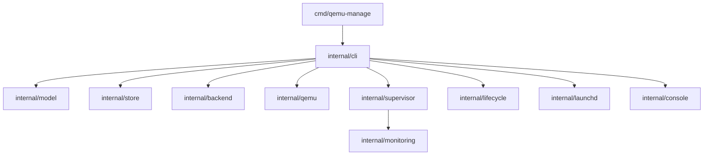

The executable delegates command handling to `internal/cli`, which coordinates the internal packages. Dependencies remain directed toward focused model, persistence, backend, and operating-system adapters; supervisor-owned monitoring consumes observations from the running backend.



## Configuration flow

```text
create command
    -> construct configuration
    -> internal/model validation
    -> stable per-name lock
    -> internal/store atomic write
    -> durable config.json
```

The create workflow constructs a strict, versioned VM configuration. `internal/model` is the validation boundary and supplies the canonical configuration hash. `internal/store` then persists desired state under the managed VM directory using secure paths, owner-only modes, a stable per-name lock, and an atomic replacement. Runtime observations are not written into the desired configuration.

The name lock serializes configuration mutations. It is distinct from the immutable-ID lifetime lock that identifies a particular VM incarnation while it is running; this distinction prevents delete-and-recreate races.

## Lifecycle flow

```text
start command
    -> re-exec qemu-manage in hidden supervise mode
    -> acquire immutable-ID lifetime lock
    -> supervisor starts and owns one QEMU child
    -> QMP readiness
    -> authenticated Unix control socket serves lifecycle requests
```

A start does not hand the VM to a shared daemon. It re-executes the same binary as a dedicated supervisor. The supervisor owns the QEMU child, child reaping, runtime metadata, and lifecycle state transitions. QMP is the authoritative channel for readiness, status, and power control; QGA is optional.

Subsequent lifecycle commands flow through `internal/lifecycle` to the per-VM supervisor. When the control socket is unavailable, status falls back conservatively to the lifetime lock and the `runtime.json` and `last_exit.json` metadata files.

## Monitoring flow

```text
QMP status + optional QGA guest data + process observations
    -> supervisor-owned monitoring loop
    -> cached observations
    -> per-VM loopback HTTP endpoints
```

`internal/monitoring` consumes backend observations under supervisor ownership. It caches QMP status, optional QGA guest information, and process state before serving the per-VM HTTP monitoring surface. The HTTP server binds to loopback; it is not the lifecycle control channel and does not replace the peer-authenticated Unix control socket.
